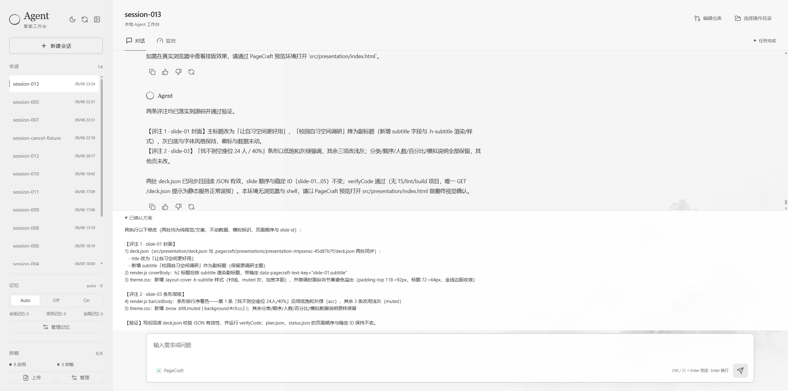
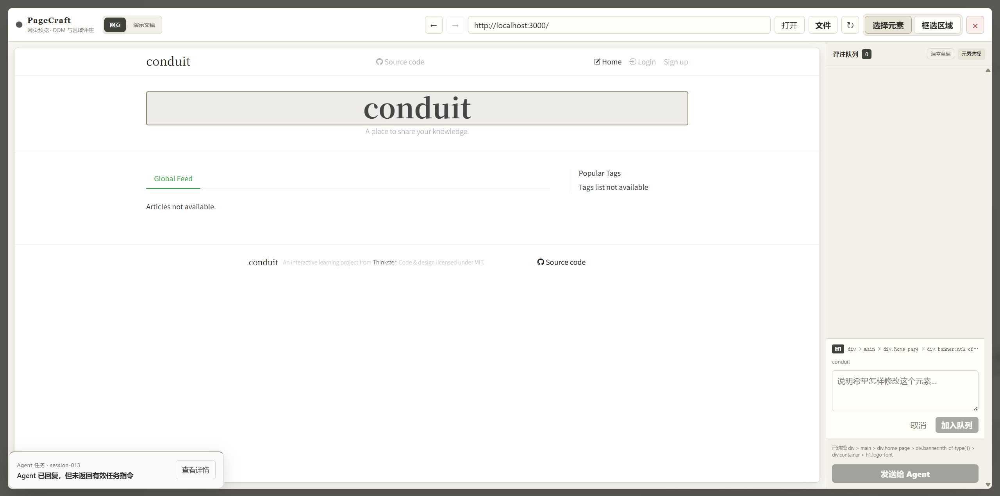
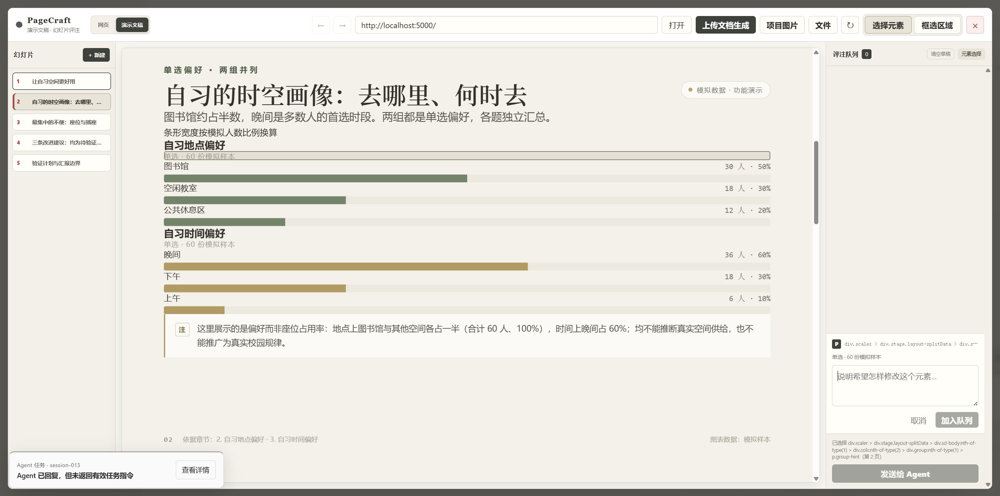
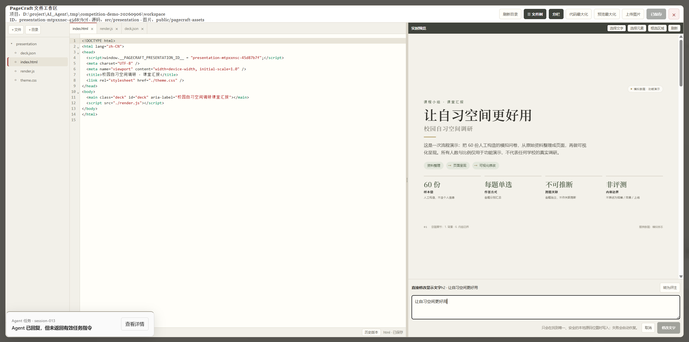

# AI Agent

### 用自然语言开发，用真实界面迭代。

AI Agent 是一个面向真实代码仓库的编程智能体。它将需求分析、方案确认、代码修改、验证与 GitHub 交付串成一条工作流，并通过 **PageCraft** 把页面、DOM 元素和网页演示文稿带入同一个开发现场。

你可以描述需求，也可以直接在页面上指出「改这里」；最终修改落在自己的项目文件中。

[快速开始](#快速开始) · [PageCraft 使用指南](plugins/dsh-frontend-feedback/README.zh-CN.md) · [架构说明](docs/architecture.md) · [开发指南](docs/development.md)

<!-- SCREENSHOT:workbench -->


## 让 Agent 看见你真正想改的地方

「把那个卡片挪一下」不必再靠反复解释。

在 PageCraft 中打开本地页面，点击真实 DOM 元素，或在空白处框选一个区域，再写下修改要求。插件会把元素选择器、容器信息、位置尺寸和布局意图组织成结构化评注，交给当前 Agent 定位源码、完成修改。

- **选中已有元素**：调整标题、按钮、卡片和页面布局。
- **框选尚不存在的内容**：明确新增区域，并区分插入、覆盖、替换。
- **多条意见一次提交**：将多个修改点加入评注队列，减少来回描述。
- **接着上次继续**：保留预览地址、选区、评论和未发送的队列。

> 例如：选中统计卡片，写下「数字加大，单位放在右下角」；再框选下方空白，补充「在这里新增趋势图，与上方卡片对齐」。

<!-- SCREENSHOT:dom-feedback -->


## 从资料到演示文稿，再精修到每一页

PageCraft 不止用于改网页，也能把文档变成可继续编辑的**网页式演示文稿**。

上传 PDF、DOCX、Markdown、TXT，或粘贴资料，说明观众、页数和演讲目标。先得到可编辑的目录，调整标题、顺序和内容后，再确认逐页生成。

生成不是终点：

- **逐页预览与评注**：在幻灯片上继续选择元素、框选区域，反馈会携带所属页面信息。
- **图片真正写入项目**：上传配图、替换图片槽位、调整裁剪与焦点，不只是临时覆盖预览。
- **保留可编辑源文件**：目录、生成状态、`deck.json`、渲染文件和素材持续保存在本地。
- **多套文稿分别管理**：每套文稿使用独立 ID 与目录，预览、源码和图片绑定同一套文稿。

<!-- SCREENSHOT:presentation -->


*演示内容为人工构造的模拟调研数据，不代表真实校园调研结果。*

> 当前产物是 HTML/React 网页幻灯片，不是原生 `.pptx` 文件；PPTX/PDF 导出尚未提供。扫描版 PDF 需要先进行 OCR。

## 预览、源码和手动编辑，使用同一份文件

PageCraft 的文件工作区直接打开项目的真实目录。你在这里、外部编辑器或 Agent 中修改的，是同一份代码。

一侧看文件与源码，另一侧看页面结果；保存时检查磁盘版本，遇到并发修改明确提示冲突。未保存草稿可恢复，近期文件版本可回看。

简单的文案调整也不必发起一轮模型对话：选择页面文字并输入新内容，PageCraft 会尝试定位唯一、可信的本地源码位置，写入后刷新验证。无法明确定位的动态内容或歧义文本会被拒绝，不会猜测修改。

<!-- SCREENSHOT:source-workspace -->


## 自动推进开发，把关键决定留给你

AI Agent 的工作流覆盖需求分析、方案设计、代码修改、验证与 PR 提交。Agent 可以调用文件检索、代码验证、仓库操作等工具，并按任务加载对应 Skill。

你始终可以看见任务所处阶段，并决定下一步：

- **先看方案，再授权执行**：确认绑定当前任务及方案版本，旧确认不能直接授权新方案。
- **插件里也能处理确认**：PageCraft 打开时，宿主的确认和补充信息面板仍可在上层展示，不必退出插件寻找消息。
- **暂停与完成分开表达**：停止当前运行不会清空历史，也不会自动回滚文件；需要时可以明确继续原任务。
- **保留项目上下文**：项目记忆、全局记忆与上下文压缩共同支持持续迭代，工具调用和响应以流式方式展示。

GitHub 交付支持 Fork、Clone、提交改动和创建 PR；使用相关能力前，需要配置仓库并登录 GitHub CLI。

## 同一个 PageCraft，两个插件宿主

AI Agent 采用与 **DeepSeek Harness（DSH）** 同风格的 Cordis 插件架构。仓库内的 `dsh-frontend-feedback` 就是 PageCraft 插件包，可以原样装入 DSH 或本项目，无需维护 AI Agent 专用的插件分支。

宿主负责会话、运行队列、任务授权与交互；插件通过标准扩展点提供工具、Skill、服务端路由和浏览器界面。PageCraft 的预览与评注能力因此可以独立迭代。

插件通过命令行管理，不需要安装管理页面。参见 [架构说明](docs/architecture.md)。

## 快速开始

需要 **Node.js 22+、npm 9+、Git**，以及支持工具调用的 OpenAI 兼容模型接口。安装插件还需要 **pnpm 9+**；Fork/PR 功能需要 **GitHub CLI（`gh`）**。

### 1. 安装与配置

```bash
git clone https://github.com/noabt187/AI_Agent.git
cd AI_Agent
npm install
```

将 [`config/model.example.json`](config/model.example.json) 复制为 `config/model.json`，填写自己的模型配置：

```json
{
  "provider": "openai",
  "base_url": "https://api.deepseek.com/v1",
  "api_key": "你的 API Key",
  "model": "deepseek-chat"
}
```

以上地址与模型名仅为配置示例，请以你所用服务实际支持的值为准。`config/model.json` 已加入 Git 忽略规则，请勿公开密钥。当前建议使用 OpenAI 兼容协议；Anthropic 原生工具调用适配尚未完成。

### 2. 安装 PageCraft

在项目根目录执行；仓库已包含插件构建产物：

```bash
npm run ai-agent -- plugin --profile web add "link:./plugins/dsh-frontend-feedback"
npm run ai-agent -- plugin --profile web list
```

不安装 PageCraft 也可以使用 Agent 对话、仓库、记忆与 Skill 管理。

### 3. 启动

```bash
npm run dev
```

默认打开 [http://localhost:5173](http://localhost:5173)，后端端口为 `3001`。在界面中选择要操作的项目目录，新建会话，即可提出第一个需求：

> 先分析这个项目的结构，找出首页和主要组件。不要修改文件，给我一个可以确认的优化方案。

进入 PageCraft 后，请填写**目标项目自己的预览地址**，不要填 AI Agent 控制台的地址。开发脚本会清理其使用的端口，建议目标项目使用不同端口。

模型配置、端口调整、GitHub 登录与开发命令见 [开发指南](docs/development.md)。

## 使用边界

- 面向本地开发及可信项目。插件是有文件系统和网络访问能力的本地代码，不是安全沙箱；只安装可信插件、预览可信地址，不要直接将开发服务暴露到公网。
- DOM 评注依赖可加载的真实页面，不是单靠截图推断元素。登录状态、严格 CSP、跨域资源等可能限制代理预览。
- 代码和演示内容由模型生成，质量依赖模型、上下文与目标项目；构建或测试通过不能替代人工审阅。建议在独立 Git 仓库或分支中操作，并检查改动范围。
- PageCraft 的更多功能说明与限制见 [中文指南](plugins/dsh-frontend-feedback/README.zh-CN.md)。

## 进一步了解

- [架构与任务交互](docs/architecture.md)：宿主与插件的职责、确认与运行状态。
- [配置与开发](docs/development.md)：模型、端口、插件管理和验证命令。
- [PageCraft](plugins/dsh-frontend-feedback/README.zh-CN.md)：DOM 评注、演示文稿、图片与文件工作区。
- [截图准备说明](docs/screenshots/README.md)：为本项目首页补充真实界面截图。
