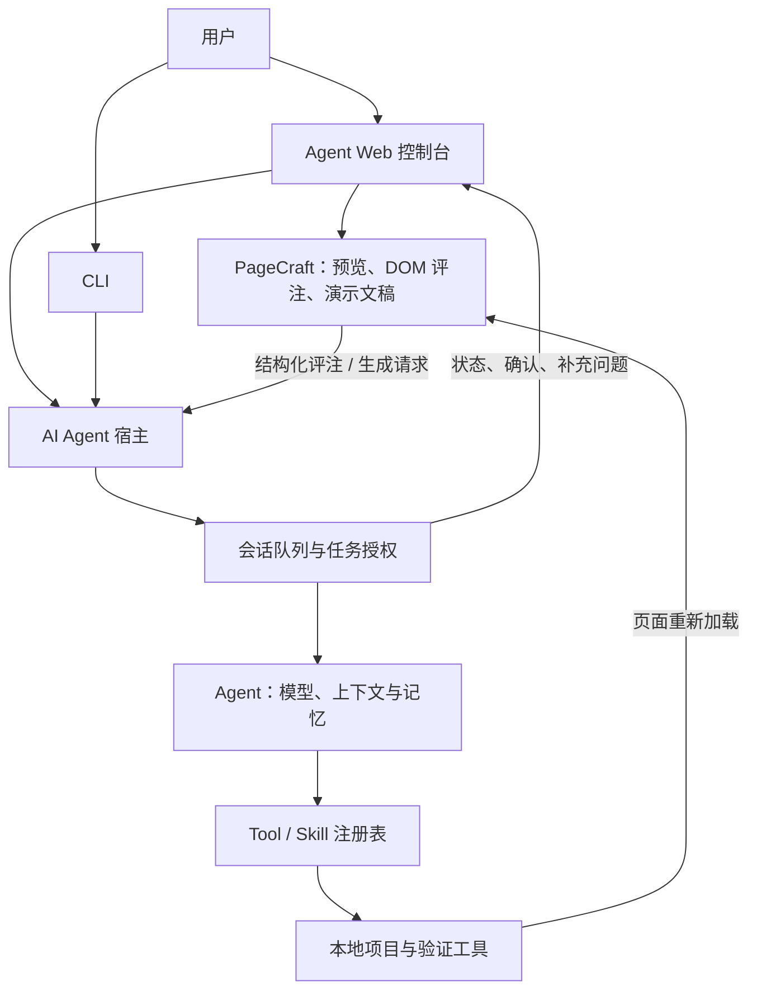

# 架构与任务交互

[返回项目首页](../README.md) · [配置与开发](development.md)

## 宿主与插件的职责

AI Agent 使用 Cordis 组织后端服务与浏览器扩展。一个 profile 组合内置 bundle、已安装插件和用户覆写配置；PageCraft 作为独立插件加入这一组合。

| 层级 | 负责什么 | 代码入口 |
| --- | --- | --- |
| Profile / bundle | 组合配置、安装插件、管理生命周期 | [`src/plugins/`](../src/plugins/)、[`bundles/`](../bundles/) |
| 宿主服务 | 提供会话、Skill、Tool 与 HTTP 能力 | [`src/plugins/services/`](../src/plugins/services/)、[`src/server/`](../src/server/) |
| 执行层 | Agent 循环、任务版本、确认授权、上下文管理 | [`src/orchestrator/`](../src/orchestrator/) |
| 浏览器宿主 | 模块加载、Slot、会话桥接、顶层任务交互 | [`web/src/plugins/`](../web/src/plugins/)、[`TaskInteractionHost.tsx`](../web/src/TaskInteractionHost.tsx) |
| PageCraft | 页面代理、结构化评注、演示文稿与文件工作区 | [`plugins/dsh-frontend-feedback/`](../plugins/dsh-frontend-feedback/) |

插件通过 `dsh.bundle.patch` 声明配置层，通过 `dsh.client` 声明浏览器产物。安装后，宿主组合 `cordis.patch.yml`、分发客户端清单并激活浏览器模块。用户覆写层在 bundle 层之后应用。

同一份 PageCraft 包可安装到 DeepSeek Harness 和 AI Agent；本仓库的集成测试覆盖真实包的安装、激活和浏览器组件交互。这不等于已验证 DSH 生态中所有插件。

## 任务不等于单次运行

一个任务可以包含多轮运行：分析、等待补充、等待确认、修改与验证。因此，HTTP 请求正常结束或一次运行结束，并不能单独证明整个任务已完成。

前端从服务端的任务与运行记录派生展示状态，不再建立另一套独立执行状态机。

| 用户操作 | 语义 |
| --- | --- |
| 发送普通新需求 | 建立当前任务，保留历史，不继承旧方案的写权限 |
| 回答当前任务的问题 | 使用当前任务的版本化跟进，不将旧回答投递给新任务 |
| 确认方案 | 绑定任务、方案版本、确认记录与操作目录；只读确认不授予写权限 |
| 调整方案 | 修订任务版本，清除原确认及写权限 |
| 停止运行 | 中断指定运行，保留历史；不自动回滚文件，不清空后继队列 |
| 继续原任务 | 明确恢复当前任务；写权限恢复要求任务、版本和目录匹配 |
| 取消任务 | 结束当前任务，保留历史；撤销待确认方案则使任务暂停 |
| 关闭 PageCraft / 按 Web Esc | 属于界面操作，不等同于停止 Agent |

CLI 的 Esc 暂停当前运行并返回输入循环；Web 使用明确的停止按钮。

## 插件打开时，确认仍然可见

宿主使用任务状态卡和顶层 `dialog` 展示正式确认、补充问题和已识别的协议异常。PageCraft 组件保持挂载，用户不必退出插件再回到主对话中寻找下一步。

- 主聊天与顶层面板共用操作控制器及活动表单。
- 收起面板或按 Esc 仅关闭详情，不取消任务，也不确认执行。
- 新方案不会继承旧确认按钮的焦点；过期或重复操作会被拒绝。
- 连接中断或状态不明确时先核实服务端状态，未核实前不开放授权操作。
- 普通回复中出现“请确认”并不自动产生授权；必须存在匹配的正式确认记录。

PageCraft 自身的生成状态与宿主任务状态是不同概念。判断是否等待用户操作，应看宿主任务状态；不能仅凭插件中的“正在规划”等文案判断执行是否仍在进行。

## 扩展接口约定

普通 `POST /api/sessions/:id/stream` 的 `{ prompt }` 与插件的 `session.prompt(content, 'queue')` 保持可用。宿主发起精确操作时，附加版本引用：

| 操作 | 控制字段 |
| --- | --- |
| 确认 / 修订 | `control: { kind: 'confirm' / 'revise', taskId, taskRevision, confirmationId }`；候选确认附精确 `selection` |
| 跟进 | `control: { kind: 'followup', taskId, taskRevision, sourceRunId }` |
| 继续 | `control: { kind: 'resume', taskId, taskRevision }` |
| 撤销待确认方案 | `DELETE /pending-confirm` 提交 `{ expected: { taskId, taskRevision, confirmationId } }` |
| 精确停止 | 附 `expectedRunId`，避免过期停止操作误伤后继运行 |

控制请求在入队和出队时校验。接收前的版本冲突返回 409，非法控制返回 400；已经开始流式响应的排队请求若过期，则发出错误事件，并记录失败的运行。

类型与实际接口以 [`src/orchestrator/types.ts`](../src/orchestrator/types.ts) 和 [`src/server/`](../src/server/) 为准。

## 信任边界

任务授权用于约束 Agent 的工具执行，但不能把插件变成安全沙箱。插件与宿主共享本地进程的文件系统、网络和安装脚本执行能力。代码验证也可能运行目标仓库的脚本。

请只安装可信插件、打开可信项目；重要改动使用独立 Git 仓库或工作分支，并审查提交内容。不要用生产凭据或不可恢复的数据测试 Agent。
